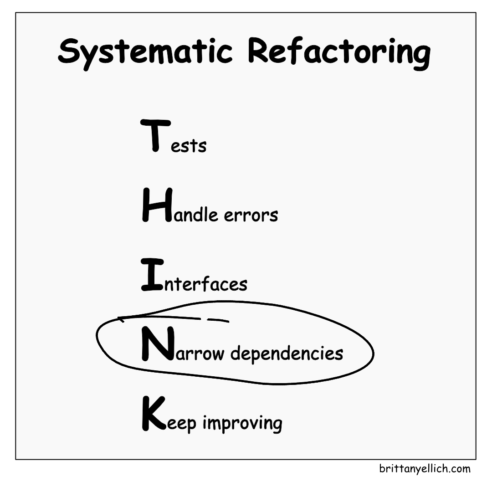

# Refactoring Go

Patterns and Practices for Maintaining and Evolving Large Codebases

<div class="absolute bottom-10">
  <p class="font-700">
    Brittany Ellich, GitHub | <a href="https://brittanyellich.com" target="_blank">brittanyellich.com</a>
  </p>
  <a href="https://github.com/brittanyellich/refactoring-go" target="_blank">
    <carbon:logo-github /> brittanyellich/refactoring-go
  </a>
</div>

<!--
Getting started.
Welcome.
Check out the slides at the repo link.
-->

---
layout: default
image: 'images/1.png'
---

<div class="flex justify-center">
    
</div>

<!--
This is your software system.
-->

---
layout: default
image: 'images/2.png'
---

<div class="flex justify-center">
    
</div>

<!--
Okay maybe this is more realistic. It's a bit hairy. It has bandaids. It has code smells.
-->

---
layout: default
---

<div class="flex justify-center">
    
</div>

<!--
Eventually, a feature comes along. Your PM wants something new which requires a significant shift in your application.
-->

---
layout: default
---

<div class="flex justify-center">
    
</div>

<!--
You have to integrate it with your system, but you've hit a wall. There's been enough complaints. 
-->


---
transition: slide-left
layout: image-right
image: 'images/4.png'
---

"It would be faster to just rewrite the whole thing"

<p v-click>Does this sound familiar?</p>

<!--
Someone on your team (maybe you) suggests a full rewrite, a brand new application.

Raise your hand. [Pause]

If you haven't seen this yet, you almost certainly will.
-->

---
transition: slide-left
layout: statement
---

You're wrong.
<p v-click>(probably)</p>

<!--
Pause.

I'm going to tell you why that's wrong in three points.
-->

---
transition: slide-left
layout: intro
---

# Refactoring Go

Patterns and Practices for Maintaining and Evolving Large Codebases

## Brittany Ellich, GitHub

[brittanyellich.com](https://brittanyellich.com)

<!--
Welcome to my talk: Refactoring Go - Patterns and Practices for Maintaining and Evolving Large Codebases

Hello my name is Brittany Ellich - Software engineer at GitHub, speaker, and educator helping developers build better software, stronger careers, and a more inclusive tech industry.

-->


---
transition: slide-left
---

# What we're going to talk about

- Refactor, don't rewrite: The top 3 arguments and why they're wrong
- How to refactor: A systematic refactoring method
- How to prioritize your refactoring efforts: Focus on impact
- Getting AI to help you: How to use agents today

<!--
Here's what we're going to talk about today
-->

---
layout: section
---

# Refactor, don't rewrite

The top 3 arguments and why they're wrong

<!--
Everyone I've worked with probably thinks this part of the talk is about when we worked together. 

The answer is yes.

Rebuilds have been the majority of my career.
-->

---
transition: slide-left
layout: image-right
image: 'images/5.png'
---

# 1. It will be faster to just rewrite it

<!--
When you plan your app, you're thinking about the feature and some of the scope of the rewrite, but as anyone who has ever guessed a story point can tell you, humans are really bad at estimating, and this is estimating on a huge scale.
-->

---
transition: slide-left
layout: image-right
image: 'images/6.png'
---

# 1. It will be faster to just rewrite it

<!--
You're focused on the 20% that's broken, but you have to rebuild the 80% that works fine
-->

---
transition: slide-left
layout: image-right
image: 'images/7.png'
---

# 1. It will be faster to just rewrite it

<!--
Not only that, there's the other app you have to maintain and support during that same time.
And that's just for support. That means no major new features for customers for the entirety of the rewrite time.
-->

---
transition: slide-left
layout: image-right
image: 'images/8.png'
---

# 1. It will be faster to just rewrite it

<p v-click>No, it won't be.</p>

<!--
And, oh yeah, you have to move all that data over and decommission the old app
-->


---
transition: slide-left
layout: image-right
image: 'images/14.png'
---

# 2. We will move faster with clean code.


<!--
Folks think they'll be able to clean everything up and it will get into a perfectly clean state with no problems.
-->

---
transition: slide-left
layout: image-right
image: 'images/15.png'
---

# 2. We will move faster with clean code.

<ul v-click>
    <li>"If we start over, we can do it right this time"</li>
    <li>"We'll avoid all the mistakes from the legacy system"</li>
    <li>"The new code will be so much cleaner and more maintainable"</li>
</ul>

<!--

-->

---
transition: slide-left
layout: image-right
image: 'images/16.png'
---

# 2. We will move faster with clean code.

Production applications are inherently messy - and that's not a bug, it's a feature.

<ul>
    <li v-click>Your "ugly" edge cases = real business requirements discovered through user feedback</li>
    <li v-click>Workarounds = institutional knowledge</li>
    <li v-click>Weird conditionals = patches for critical customer scenarios from a 2AM outage</li>
    <li v-click>"Unnecessary" features = critical dependencies for actual users</li>
</ul>

<!--
Messiness reflects the real-world complexity. 

Your "ugly" edge cases represent actual business requirements.
The workarounds encode institutional knowledge. 
That weird conditional isn't poor coding - it's handling a critical customer scenario someone discovered at 2 AM during an outage.
Accumulated complexity serves users: Every seemingly unnecessary feature exists because someone, somewhere, depends on it.
-->

---
transition: slide-left
layout: image-right
image: 'images/17.png'
---

# 3. The current technology stack is holding us back.

<ul v-click>
    <li>"If we rebuild in X, we will solve all our performance problems"</li>
    <li>"We're spending too much time fighting against outdated tools"</li>
    <li>"New developers can't be productive in this legacy stack"</li>
</ul>

<!--
A lot of times these efforts come with an excuse for the team to learn a new technology. But anything created in the last several years is probably fine. It's not the technology, it's how you use it.

It's easy to learn a new technology, but hard to learn it well. That learning is going to be an undertaking on its own. 

While I love a greenfield project as much as the next engineer...

Refactoring a legacy codebase is arguably much more technically interesting. 

I argue it's more impactful to modernize a legacy codebase in less time and a technology the team is already familiar with than to rewrite a brand new one.
-->

---
transition: slide-left
layout: image-right
image: 'images/18.png'
---

# 3. The current technology stack is holding us back.

It isn't.

<!--
Good software design principles can be applied to any tech stack.

An aside, if it isn't already in Go, rewrite in Go :) Not only because we are at a Go conference, but if you're in the business of building long-term software (which you probably are) the compatibility guarantee is priceless. If you want to write once and run forever, Go is the language to use.
-->

---
layout: center
class: text-center
---

# Refactor, don't rewrite.

<p v-click>You don't need a rewrite.</p>
<p v-click>It will take too long.</p>
<p v-click>All production applications are messy.</p>
<p v-click>You won't suddenly work better by adopting a new technology.</p>

<!--
There are some cases where a rebuild makes sense. But if you can't clearly articulate why a rebuild is necessary, refactor instead.

You probably don't need a rewrite.
It will probably take too long.
Your production application will not be the perfect, bug-free, clean-code space you think it will be.
You won't suddenly work better by adopting a new technology.
-->

---
layout: quote
---

# The best software products emerge from continuous improvement, not perfect planning.

<!--
Agile > Waterfall
-->

---
layout: default
---

# So how do we identify what to refactor?

---
layout: section
---

# How to refactor

A systematic refactoring method

---
transition: slide-left
layout: image-right
image: 'images/19.png'
---

# THINK: A Systematic Refactoring Mindset

<ul>
    <li v-click><bold>Tests</bold>: A safety net before changing anything</li>
    <li v-click><bold>Handle errors</bold>: This affects the rest of your application's structure</li>
    <li v-click><bold>Interfaces</bold>: These define your system's boundaries</li>
    <li v-click><bold>Narrow dependencies</bold>: Remove library dependencies (where possible), reduce hard-coding, use dependency injection</li>
    <li v-click><bold>Keep improving</bold>: Continuous improvement > dramatic changes</li>
</ul>

<!--
- Tests: A safety net before changing anything These are a guide through the entire refactoring process. Add characterization tests to capture current behavior, then refactor with confidence from Working Effectively with Legacy Code by Michael Feathers
- Handle errors: Error handling, particularly with Go, is critical to overall application structure.
- Interfaces: This allows you to focus on your application's boundaries
- Narrow dependencies: Remove library dependencies where possible, reduce hard-coding, use dependency injection
- Keep improving - Do this alongside feature work, don't wait for refactoring sprints
-->

---
layout: default
---

<div class="flex justify-center">
    
</div>

<!--
- Tests: A safety net before changing anything These are a guide through the entire refactoring process. Add characterization tests to capture current behavior, then refactor with confidence from Working Effectively with Legacy Code by Michael Feathers
-->

---
transition: slide-left
layout: image-right
image: 'images/working.jpg'
---

# Tests

- A safety net before changing anything
- A guide to the refactoring process
- Add characterization tests if you're missing tests
- Working Effectively with Legacy Code by Michael Feathers

---
layout: default
---

<div class="flex justify-center">
    
</div>

<!--
Handle errors: Error handling, particularly with Go, is critical to overall application structure.
-->

---
transition: slide-left
---

# Handle errors

**The Problem**: Lost context, double handling (logging and returning an error), silent failures (no error handling at all)

```go
// Bad: No context, inconsistent patterns
return errors.New("invalid amount")

// Good: Clear context and consistent wrapping
return fmt.Errorf("process payment: invalid amount %.2f", amount)
```

**Go Proverb**: ["Errors are values"](https://go-proverbs.github.io/) - program with them, don't just check them

**Reading**: "100 Go Mistakes" #49-52 on error handling patterns

<!--
Over time, the ways that errors are handled tend to drift
Critical for application structure and for your debugging experience
**Why prioritize**: Code readability, debugging

-->

---
layout: default
---

<div class="flex justify-center">
    
</div>

---
transition: slide-left
---

# Interfaces

**The Problem**: Large interfaces force clients to depend on methods they don't use

```go
// Bad: Clients depend on methods they don't use
type UserService interface {
    CreateUser(u User) error
    SendEmail(to string) error
    ...
}

// Good: Focused, testable interfaces
type UserManager interface {
    CreateUser(u User) error
}
type NotificationService interface {
    SendEmail(to, subject, body string) error
}
```

**Go Proverb**: ["The bigger the interface, the weaker the abstraction"](https://go-proverbs.github.io/)

**Reading**: "100 Go Mistakes" #5-7 on interface design

<!--
**Why prioritize**: Dramatically improves testing and reduces coupling
-->

---
transition: slide-left
---

# Interfaces

**The Problem**: Using any/interface{} when specific types would be better

```go
// Bad: Runtime type checking required
func Process(data interface{}) error

// Good: Specific interfaces or generics
func Process[T Processor](data T) error
```

**Go Proverb**: ["The empty interface says nothing"](https://go-proverbs.github.io/)

**Reading**: "100 Go Mistakes" #8 on any usage

<!--
Catches errors at compile time instead of runtime
There are some use cases for this (ex. marshaling)
**Why prioritize**: Type safety helps catch errors at compile time instead of at runtime
-->

---
layout: default
---

<div class="flex justify-center">
    
</div>

<!--
- Narrow dependencies: Remove library dependencies where possible, reduce hard-coding, use dependency injection
-->

---
transition: slide-left
---

# Narrow dependencies

**The Problem**: Adding direct dependencies increase coupling and make things hard to test

```go
// Bad: Hard to test, tightly coupled
func ProcessOrder(customerID string, items []string) error {
    db := sql.Open("postgres", "...") // Direct dependency
    // ... processing logic
}

// Good: Dependency injection
type OrderService struct {
    repository OrderRepository
}
func (s *OrderService) ProcessOrder(req OrderRequest) error
```

**Why prioritize**: Make testing easier

<!--

-->

---
transition: slide-left
---

# Narrow dependencies

**The Problem**: Single structs mixing API responses, database, and validation concerns

```go
// Bad: Mixed concerns
type User struct {
    ID       int    `json:"id" db:"user_id" validate:"required"`
    Name     string `json:"name" db:"full_name" validate:"min=2,max=50"`
    Email    string `json:"email" db:"email_addr" validate:"email"`
    Password string `json:"-" db:"password_hash"`
}

// Good: Separated concerns
type UserAPI struct {     // API representation
    ID    int    `json:"id"`
    Name  string `json:"name"`
    Email string `json:"email"`
}
type UserDB struct {      // Database model
    ID       int    `db:"user_id"`
    Name     string `db:"full_name"`
    Email    string `db:"email_addr"`
    Password string `db:"password_hash"`
}
```

**Why prioritize**: Mixed concerns make changes more difficult

<!--
Mixed concerns make evolution painful. Changing JSON structure shouldn't require database migration
Reading: Clean Architecture principles, Domain-Driven Design
-->


---
transition: slide-left
---

# Narrow dependencies

**The Problem**: Hard-coded business rule changes require code deployments instead of configuration updates

```go
// Bad: Business logic embedded in code
func CalculateDiscount(total float64, customerType string) float64 {
    if customerType == "premium" {
        return total * 0.15  // Hardcoded 15%
    }
    return 0
}

// Good: Configurable service
type DiscountService interface {
    CalculateDiscount(total float64, customer Customer) float64
}
```

**Why prioritize**: Make it easy to change your application

<!--

-->

---
layout: default
---

<div class="flex justify-center">
    
</div>

<!--
- Keep improving - Do this alongside feature work, don't wait for refactoring sprints
-->

---
layout: center
class: text-center
---

# Keep improving

<p v-click>Refactor as you go</p>
<p v-click>Continuously iterate and deliver value</p>
<p v-click>Don't wait for an occasional refactoring sprint</p>


---
layout: quote
---

# The best software products emerge from continuous improvement, not perfect planning.

<!--
Coming back to this from earlier :) 
-->

---
layout: section
---

# How to prioritize your refactoring efforts

---
transition: slide-left
layout: image-right
image: 'images/9.png'
---

# A prioritization framework

<!--
Categorize each item by the amount of effort and amount of impact
-->

---
transition: slide-left
layout: image-right
image: 'images/10.png'
---

# A prioritization framework

<!--
It roughly looks like this!
-->

---
transition: slide-left
layout: image-right
image: 'images/11.png'
---

# A prioritization framework

The Three-Bucket Approach

- High Impact, Low Effort: Start here

<!--
It roughly looks like this!

- Add error context where missing
- Extract hardcoded values to configuration
- Replace empty interfaces with types
-->

---
transition: slide-left
layout: image-right
image: 'images/12.png'
---

# A prioritization framework

The Three-Bucket Approach

- High Impact, Low Effort: Start here
- High Impact, High Effort: Plan next

<!--
It roughly looks like this!

- Break one large interface into focused ones 
- Separate tightly coupled models
- Standardize error handling across packages
-->

---
transition: slide-left
layout: image-right
image: 'images/13.png'
---

# A prioritization framework

The Three-Bucket Approach

- High Impact, Low Effort: Start here
- High Impact, High Effort: Plan next
- Low Impact, Any Effort: Ignore this

<!--
It roughly looks like this!

- Don't worry about the low impact stuff, YAGNI
-->

---
layout: section
---

# How to get AI to help you

<!--
Would this be a talk in 2025 if I didn't mention AI?
-->

---
layout: default
---

# Coding agent use cases

<div class="flex">
    <div>
        <ul>
            <li v-click>Increasing test coverage</li>
            <li v-click>Searching your codebase to find inconsistent approaches</li>
            <li v-click>Taking patterns and applying them across your codebase incrementally</li>
            <li v-click><a href="https://github.blog/ai-and-ml/github-copilot/how-the-github-billing-team-uses-the-coding-agent-in-github-copilot-to-continuously-burn-down-technical-debt/">How the GitHub billing team uses the coding agent in GitHub Copilot to continuously burn down technical debt</a></li>
        </ul>
    </div>
    <div style="width: 70%">
        
    </div>
</div>


<!--
An aside: I work at GitHub. I'm not here to sell you all on Copilot. That's not my job. But this is the tool I've used the most.

My opinion on AI has changed over time.

These are all great use cases because I know that they work

There are ways to make this work better (ask me about them/read my blog post about it!)
-->

---
layout: default
---

# Increasing test coverage with the coding agent in GitHub Copilot

> In order to build more confidence in our code changes, we should try to get as close to 100% as possible in our test coverage. Search the test files in the lib/services directory and identify if there are any paths that aren't currently tested. Create table-driven tests to cover those scenarios.

[Dave Cheney: Prefer Table-Driven Tests](https://dave.cheney.net/2019/05/07/prefer-table-driven-tests)

<!--
Note we are looking at specific folders, not the entire application
-->


---
layout: default
---

# Searching your codebase to find inconsistent approaches with the coding agent in GitHub Copilot

> We would like to standardize on the following error handling specification for errors in the lib/services directory. Help me identify anywhere that we are not currently handling errors in this way in this directory and update them to use this syntax, with reasonable error messages to support them.

```go
return fmt.Errorf("failed to process payment for order %s: %w", orderID, err)
```


---
layout: default
---

# Taking patterns and applying them across your codebase incrementally

> Use this PR as an example to swap from the existing mocking library to this new one for mocks in the lib/services directory.

<!--
Create the first step and ask the agent to apply it to the rest of your application (one folder at a time)
-->


---
layout: section
---

# Recap

- Refactor, don't rewrite: The top 3 arguments and why they're wrong
- How to refactor: A systematic refactoring method (THINK)
- How to prioritize your refactoring efforts: Focus on impact
- Getting AI to help you: How to use agents today

---
layout: quote
---

# The best software products emerge from continuous improvement, not perfect planning.

<!--
Coming back to this from earlier :) 
-->

---
layout: default
---

# Acknowledgements

- My incredible partner who is hanging out with our three young kids while I travel
- The incredible team putting this conference together
- My GitHub colleagues who have given me so much feedback, advice, and motivation
- Bill Kennedy, who suggested that I should submit a talk to this conference
- My brother, Brad Heller who is here today!

---
layout: default
---

# Resources

- Book: [Working Effectively with Legacy Code - Michael Feathers](https://learning.oreilly.com/library/view/working-effectively-with/0131177052/)
- Book: [100 Go Mistakes - Teiva Harsanyi](https://100go.co/)
- Video: [Go Proverbs](https://go-proverbs.github.io/)
- Article: [Dave Cheney: Prefer Table-Driven Tests](https://dave.cheney.net/2019/05/07/prefer-table-driven-tests)
- Article: [How the GitHub billing team uses the coding agent in GitHub Copilot to continuously burn down technical debt](https://github.blog/ai-and-ml/github-copilot/how-the-github-billing-team-uses-the-coding-agent-in-github-copilot-to-continuously-burn-down-technical-debt/)

## Thank you!

My website is [brittanyellich.com](https://brittanyellich.com), let's be internet friends!

<a href="https://github.com/brittanyellich" target="_blank">
    <carbon:logo-github />
</a>

<a href="https://www.linkedin.com/in/brittanyellich/" target="_blank">
    <carbon:logo-linkedin />
</a>

